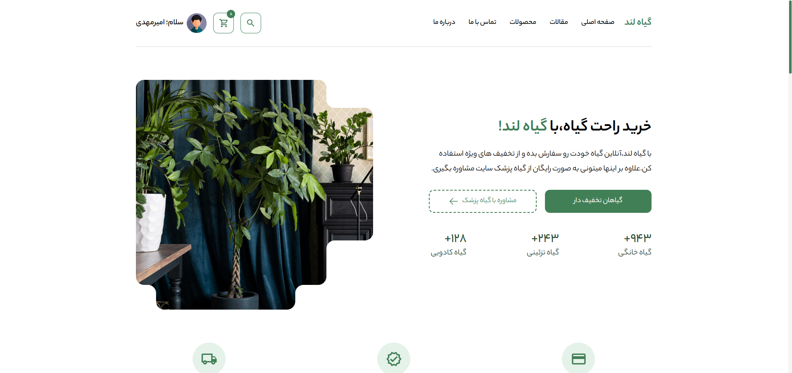
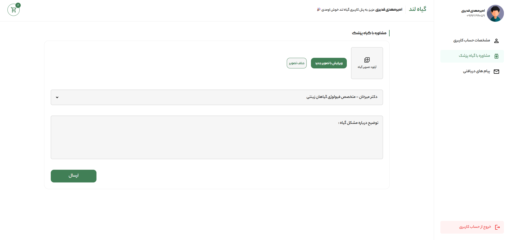
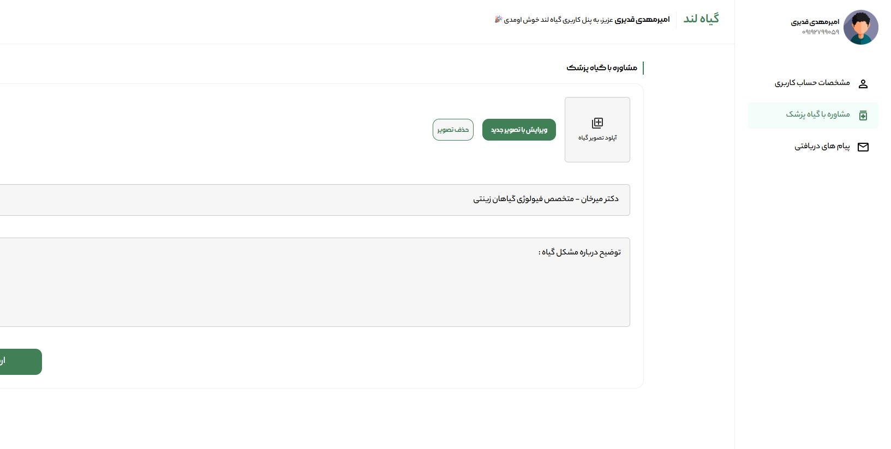
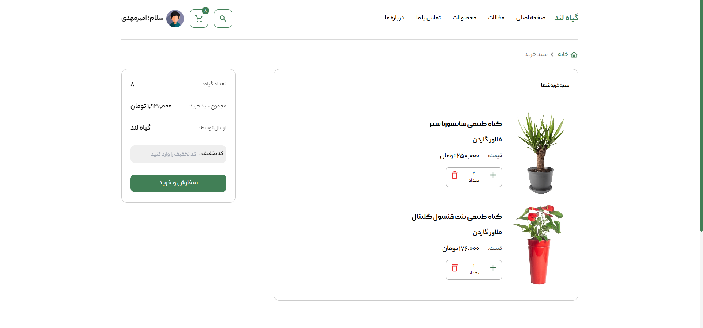
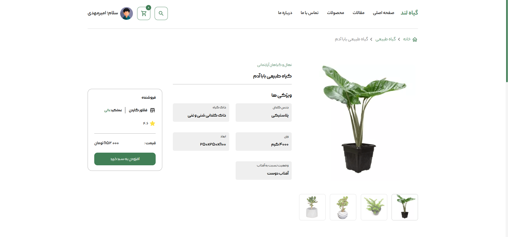

# 💻 Giyah Land Online Shop  

## 📖 About Project

**Giyah Land** is an online store developed using **JavaScript** and **TailwindCSS**.

This project was a valuable learning experience and involved several real-world challenges,  
including building a **fully responsive design**, managing **shopping cart logic**,  
handling application logic with vanilla JavaScript, and creating **reusable UI components**  
to keep the codebase clean and scalable.

The project is connected to a **Back-End API** for handling dynamic data  
such as products, users, and orders.

The main goal of this project was to build a modern online store for **selling plants and pots**,  
while strengthening my practical front-end development skills.

## 🛠️ Technologies used   

   

  ## How to Use

To clone the project, run the following command:

```bash
git clone https://github.com/amirmahdighadiri/giyah-land.git
```
### Install dependencies

You can use one of them `npm`, `yarn`, `pnpm`, `bun`, Example using `npm`:

```bash
npm install
```
#### If You Haven't Installed npm-run-all Before, Run The Following Command.

```bash
npm i -d npm-run-all
```
### Build The Tailwind Codes

```bash
npm run t
```
### Run the development server

```bash
npm run dev
```

<br/>
<br/>

<h2>📷 Demo Images :</h2>


<br/>

<br/>

<br/>

<br/>

<br/>

